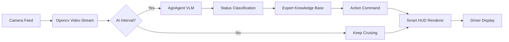

# AgriAgent: On-Board Intelligent Agricultural Inspection System

# AgriAgent：基于多模态大模型的车载农业巡检系统

> 🎓 **Project Origin**: Nankai University | Intelligent Science & Technology
> 🚜 **Core Tech**: MiniCPM-Llama3-V-2.5 + Edge Computing + Smart HUD

## 📖 Introduction (项目简介)

**AgriAgent** is an intelligent system designed for agricultural autonomous vehicles. It leverages the power of Vision-Language Models (VLM) to perform real-time crop health monitoring. Unlike traditional CV methods, AgriAgent understands context and provides actionable advice.

本项目旨在为农业自主作业车辆提供“大脑”。系统集成了轻量级多模态大模型（MiniCPM-V），能够实时处理车载摄像头视频流，对作物进行**病虫害诊断**、**生长状态评估**，并通过增强现实仪表盘（Smart HUD）向用户提供可视化决策支持。

## ✨ Key Features (核心功能)

- **👁️ VLM-Powered Diagnosis**: Utilizes `MiniCPM-Llama3-V-2.5` for high-precision crop status identification (Healthy/Disease/Pest).
  - _基于视觉语言模型的精准诊断，支持自然语言理解。_
- **🏎️ Real-Time Simulation**: Mock driver workflow with an interval-based AI inference engine.
  - _模拟车载巡航场景，采用间隔推理机制平衡算力与实时性。_
- **📊 Smart HUD**: Custom-built visualization interface supporting Chinese display and status overlays.
  - _智能仪表盘，支持中文渲染、延迟监控及动态指令显示。_
- **🧠 Expert System**: Integrated rule-based knowledge base for immediate agricultural advice.
  - _内置专家知识库，根据诊断结果自动匹配农事建议（如喷洒、减速、巡航）。_（待进一步更新）

## 🛠️ System Architecture (系统架构)



## 🚀 Quick Start (快速开始)

### 1. Environment Setup (环境配置)

Ensure you have Python and a CUDA-enabled GPU (RTX 3090/4090 recommended).

CUDA-enabled GPU (Recommended for real-time inference)

Verified on RTX 3090/4090

### 2. Installation (安装)

#### Clone the repository

```Bash
git clone [https://github.com/summerwind0131/Agri-Agent-MiniCPM.git](https://github.com/summerwind0131/Agri-Agent-MiniCPM.git)
cd Agri Agent MiniCPM
```

#### Install dependencies

```python
   conda create -n agriagent python=3.10
   conda activate agriagent
   pip install -r requirements.txt
```

### 3. Model Preparation (模型准备)

Please download the MiniCPM-Llama3-V-2_5 weights from HuggingFace or ModelScope and place them in the directory defined in src/agri_agent.py.

### 4. Run Simulation (运行仿真)

```Bash

   python src/simulation_pro.py
```

## 📂 File Structure (文件说明)

src/agri_agent.py: Core Logic. Wraps the VLM model, handles image preprocessing and prompt engineering.

src/ui_utils.py: UI Module. Handles Chinese font rendering and HUD layout drawing using PIL & OpenCV.

src/simulation_pro.py: Main Loop. Manages video flow, AI inference timing, and system state updates.

## 📝 Future Plans (未来计划)

[ ] Optimize inference speed with TensorRT.

[ ] Connect to real CAN bus data from the agricultural vehicle.

[ ] Dataset: Fine-tune the model on specific specialized crop disease datasets.

---

Developed by Fengyuan @ Nankai University.

> > > > > > > 658c70a250bcca8ebc9bbc699d09f7232724ed65
